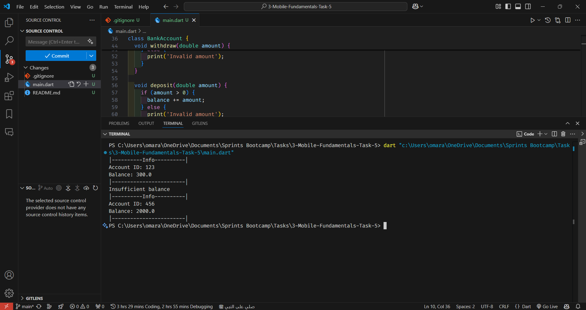

# Create a BankAccount Class to Withdraw or Deposit Amount of Money

This program creates a BankAccount class to withdraw or deposit amount of money.

## Requirements

### Requirement 1

**Title:** Create a BankAccount class  
**Description:** The program should implement a BankAccount class that has the following properties:

- `balance`: A double value that represents the current balance of the bank account.
- `BankAccount()`: A constructor that initializes the balance to 0.0.
- `deposit(double amount)`: A method that takes a double value as a parameter and adds it to the balance.
- `withdraw(double amount)`: A method that takes a double value as a parameter and subtracts it from the balance.
- `displayAccountInfo()`: A method that displays the current balance of the bank account.

## Code Explanation

```dart
class BankAccount {
  int accountID;
  double balance;

  BankAccount(this.accountID) : balance = 0;

  BankAccount.withBalance(this.accountID, this.balance);

  void withdraw(double amount) {
    if (amount > 0) {
      if (balance >= amount) {
        balance -= amount;
      } else {
        print('Insufficient balance');
      }
    } else {
      print('Invalid amount');
    }
  }

  void deposit(double amount) {
    if (amount > 0) {
      balance += amount;
    } else {
      print('Invalid amount');
    }
  }

  void displayAccountInfo() {
    print('Account ID: $accountID');
    print('Balance: $balance');
  }
}
```

## Code Output

```
|----------Info----------|
Account ID: 123
Balance: 300.0
|------------------------|
Insufficient balance
|----------Info----------|
Account ID: 456
Balance: 2000.0
|------------------------|
```

## Code Output Screenshot



## How to Run

1. Copy the code into a Dart file.
2. Run the Dart file using a Dart compiler or an IDE that supports Dart.
3. The output will display the account information and the balance after depositing and withdrawing money.
